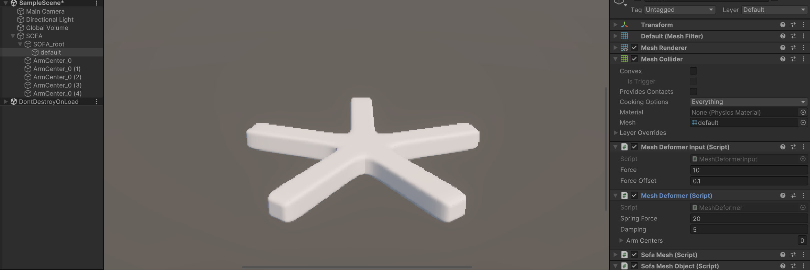
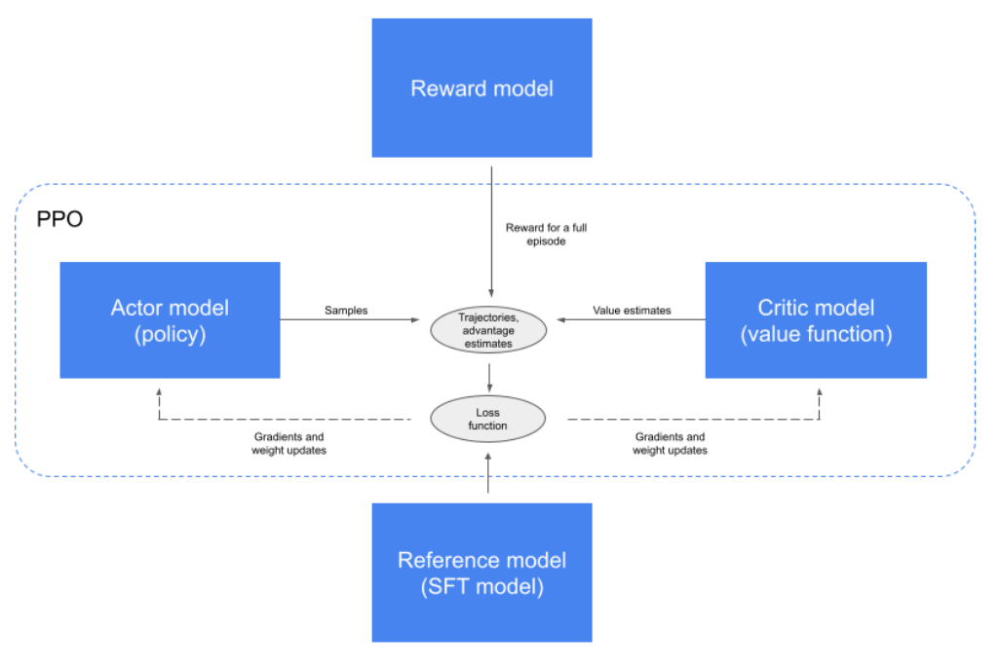
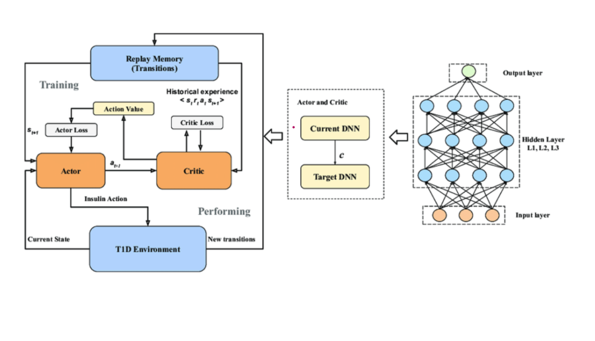
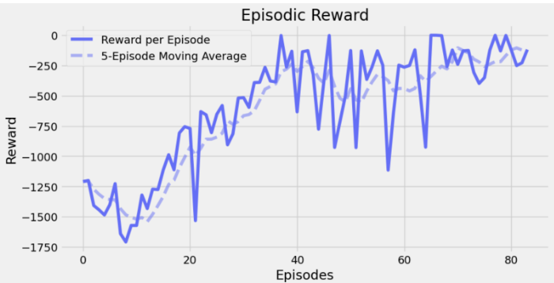
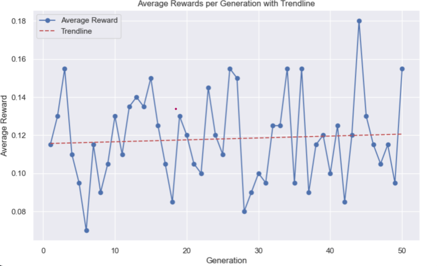
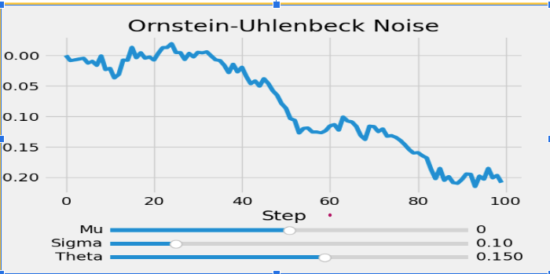

# Advancing Soft Robots with Evolutionary and Reinforcement Learning

**Lead Researcher**: [Aba Onumah](edin.com/in/aba-onumah-63315328b/)  
**Faculty Advisor**: Dr. Yu Xiang  
**Team Members**: Anish Reddy, Alle Arjun Krishnan, Jessica Myoungbin Choi, Rohit Penna

---

## Introduction and Purpose

Soft robotics is an emerging field that utilizes flexible materials such as rubber or EcoFlex to create robots capable of adapting to a wide variety of tasks. These robots are especially useful where traditional rigid robots may struggle, in dynamic environments like cave systems, disaster sites, agricultural fields, and deep-sea exploration.

However, designing and building soft robots from scratch to autonomously interact with these environments is a highly resource-intensive process, often requiring significant time, effort, and coordination to test and refine their performance. 

We present a unique approach by integrating **evolutionary algorithms (EAs)** with **reinforcement learning (RLs)**. This combination enables more efficient design and adaptation of soft robots, reducing both time and resource expenditures while enhancing their autonomy and robustness in unpredictable environments.

---

## Components

### Figure 1. Unity and SOFA Combined
<!--| Image 1 | Image 2 |
| ------- | ------- |
|  |  |-->

  
  

For the development of our soft robotic model, we utilized two primary tools: **Unity** and the **SOFA Framework**.

- **Unity** provided the platform for simulating and visualizing the soft robot’s environment, leveraging its powerful physics engine and machine learning capabilities.
- **SOFA Framework** was employed to simulate soft body dynamics, enabling the modeling of deformable structures with high realism.

These tools were integrated by using Unity’s **ML-Agents** for environment simulation and SOFA’s components for the soft body physics. While we successfully managed to integrate deformations into the model, the robot’s movement was not fully realized at the time of this poster’s creation. Further research will focus on refining the movement dynamics and enhancing the interaction between components.

---

## Models
<!--

### **Proximal Policy Optimization (PPO)**
PPO is a **reinforcement learning (RL)** algorithm that utilizes an **Actor-Critic Network** with shared layers for feature extraction. The **Actor** determines the probabilities of taking specific actions from a given state, while the **Critic** evaluates these actions by assessing the current state. This structure ensures policy updates are constrained within a threshold, preventing drastic policy changes.

In our project, we integrated PPO into an Evolutionary Framework, applying **evolutionary algorithms (EAs)** to both the **population** and **hyperparameters**. Each generation of policies is evolved through multiple strategies, including a **mutation function** that injects noise into parameters and tweaks hyperparameters for the next generation. This optimization aims to enhance the **rewards** gained by the agent.  

Our model has produced *exceptional results* in simple **OpenAI Gym environments**. However, in the continuous **Unity environment**, it is still a work in progress. While we are obtaining consistent results, further modifications in applying EAs to hyperparameters are under exploration to achieve optimal performance.

### **Deep Deterministic Policy Gradient (DDPG)**
DDPG is another **RL algorithm** designed for **continuous action spaces**, utilizing an **Actor-Critic model**. The **Actor** learns a **deterministic policy** by mapping states directly to specific actions, while the **Critic** estimates the value of these actions using **Q-learning**. DDPG leverages a **replay buffer** to sample past experiences and employs **Ornstein-Uhlenbeck processes** to add noise to the actor’s actions, promoting exploration.

We integrated DDPG with an **Evolutionary Framework** by initializing a population of agents with random hyperparameters. These agents are evaluated for performance, and the **best-performing individuals** are selected to create new generations through **crossover** and **mutation**. This evolutionary process enables the agent to explore a wider range of **hyperparameter combinations**, optimizing rewards more effectively.
-->
<table>
  <tr>
    <td style="width: 50%; text-align: center;">
      
    </td>
    <td style="width: 50%; text-align: center;">
      
    </td>
  </tr>
  <tr>
    <td style="vertical-align: top; padding: 10px;">
      <h3><strong>Proximal Policy Optimization (PPO)</strong></h3>
      

        PPO is a <strong>reinforcement learning (RL)</strong> algorithm that utilizes an <strong>Actor-Critic Network</strong> with shared layers for feature extraction.
        The <strong>Actor</strong> determines the probabilities of taking specific actions from a given state, while the <strong>Critic</strong> evaluates these
        actions by assessing the current state. This structure ensures policy updates are constrained within a threshold, preventing drastic policy changes.
      

      

        In our project, we integrated PPO into an <strong>Evolutionary Framework</strong>, applying <strong>evolutionary algorithms (EAs)</strong> to both the
        <strong>population</strong> and <strong>hyperparameters</strong>. Each generation of policies is evolved through multiple strategies, including a
        <strong>mutation function</strong> that injects noise into parameters and tweaks hyperparameters for the next generation. This optimization aims to enhance
        the <strong>rewards</strong> gained by the agent.
      

    </td>
    <td style="vertical-align: top; padding: 10px;">
      <h3><strong>Deep Deterministic Policy Gradient (DDPG)</strong></h3>
      

        DDPG is another <strong>RL algorithm</strong> designed for <strong>continuous action spaces</strong>, utilizing an <strong>Actor-Critic model</strong>.
        The <strong>Actor</strong> learns a <strong>deterministic policy</strong> by mapping states directly to specific actions, while the <strong>Critic</strong>
        estimates the value of these actions using <strong>Q-learning</strong>. DDPG leverages a <strong>replay buffer</strong> to sample past experiences and
        employs <strong>Ornstein-Uhlenbeck processes</strong> to add noise to the actor’s actions, promoting exploration.
      

      

        We integrated DDPG with an <strong>Evolutionary Framework</strong> by initializing a population of agents with random hyperparameters. These agents
        are evaluated for performance, and the <strong>best-performing individuals</strong> are selected to create new generations through
        <strong>crossover</strong> and <strong>mutation</strong>. This evolutionary process enables the agent to explore a wider range of
        <strong>hyperparameter combinations</strong>, optimizing rewards more effectively.
      

    </td>
  </tr>
</table>

---

## Results

<!--### 
###   -->

  
  

### **Deep Deterministic Policy Gradient (DDPG)**
This graph shows the changing **episodic reward** of a **Deep Deterministic Policy Gradient (DDPG)** model as it trains. The core concept behind our approach is inspired by **survival of the fittest**, where we evolve hyperparameters through **random reproduction** and **mutation rates**. This evolutionary process trains multiple models, selecting the best-performing configurations over generations.

To optimize the DDPG model, we utilized a **replay buffer** that stores tuples of states and actions. These tuples include both the **current state-action pair** and the **next state-action pair**, allowing the model to approximate the expected returns without needing to solve the infinite integral directly. Each agent follows an **Actor-Critic architecture**, where the **Actor** proposes actions based on the current state, and the **Critic** evaluates these actions to optimize policies greedily.

**Environment Simulation with Unity ML-Agents:**
To generate **state-action possibilities** for each model, we used **Unity’s ML-Agents Python library**. This library allows us to simulate complex environments, akin to **OpenAI Gymnasium environments**, within Unity. It also provides visualizations of the training process, helping us observe how each model evolves over time. These visualizations offer valuable insights into the progression and adaptability of each generation of models.

### **Proximal Policy Optimization (PPO)**
We extended our evolutionary strategy beyond hyperparameters. Instead of solely evolving hyperparameters, we implemented a process where the **policies** or **hyperparameters** of parent models are *crossed randomly* to generate the next generation. This technique aims to combine the strengths of different models to produce superior offspring.

However, our current PPO implementation faces challenges. The model is not learning from its environment as quickly as expected. While it demonstrates **consistent rewards** with a gradually increasing trend line through generations (as seen in the graph), further optimization is necessary. We are actively exploring ways to refine this approach, particularly by improving the application of evolutionary algorithms to enhance reward optimization and accelerate learning.

---

## Analysis

<!--### -->

  

In our approach to **DDPG**, we evolve populations of agents across multiple generations using **Evolutionary Algorithms (EA)**. This method involves culling half of the population at each generation, which leads to **higher learning efficiency** and **improved policy performance**. By incorporating EA into the training process, we are able to **optimize hyperparameters more effectively** than in traditional RL methods, requiring fewer iterations to reach optimal performance.

The inclusion of **Ornstein-Uhlenbeck noise** added another layer of exploration to the model, encouraging the agent to explore a wider range of actions and states. This contributed to better performance by preventing premature convergence to suboptimal policies. Additionally, we believe that incorporating other EA techniques, such as **elitism**, could further enhance the training process by preserving top-performing agents across generations.

 

For our **PPO** approach, we employed a unique strategy where we not only evolved the model's **hyperparameters**, but also introduced **weight-crossing**—randomly swapping the weights between parent models to create offspring. This crossover technique provided some advantages in simpler environments, where fewer generations of training were needed. However, in more complex environments, this strategy struggled to maintain efficiency, requiring more training time and generations to achieve similar performance to the **DDPG-based EA** approach.

In summary, while **DDPG's EA-based framework** demonstrated superior efficiency in hyperparameter optimization, **PPO's weight-crossing method** proved effective in less complex settings but faced challenges when applied to more intricate tasks. The EA-enhanced DDPG model converged on the best policies faster, while PPO required more training time to achieve comparable results.

---

## Conclusion

Although the results available at the time of this poster are limited, the preliminary findings indicate a promising trend. Specifically, the tuning of **hyperparameters** has led to an **exponential increase** in reaching optimal rewards for both **reinforcement learning (RL)** models and **evolutionary algorithms (EA)**. These early results suggest that with further research, the potential of **EAs** and **RLs** in **soft robotics** could be substantial. We are optimistic that continued exploration will highlight their effectiveness and the critical role they could play in enhancing the performance of **soft robots** in complex, dynamic environments.

By combining **soft robotics** with **evolutionary reinforcement learning (ERLs)**, we open up new possibilities for creating **adaptive**, **self-optimizing robots** capable of autonomously interacting with their environment. **Soft robots**, with their flexibility and compliance, are uniquely suited to tasks in unpredictable environments like **underwater exploration**, **search and rescue missions**, and **remote surgery**. However, their performance often depends on their ability to adjust in real-time to varied and often harsh conditions. This is where the fusion of **RL** and **EA** becomes pivotal. Through **RL**, robots can learn optimal behaviors from experience, while **EAs** enhance this learning process by evolving better-performing agent populations over generations. This synergy not only accelerates the robot's ability to adapt but also optimizes their **hyperparameters** and **control strategies** more efficiently than traditional approaches.

Looking to the future, the integration of **soft robotics** with **ERLs** holds the potential to revolutionize industries that demand flexibility and adaptability. In **ocean exploration**, **soft robots** could navigate deep-sea environments, adapting to complex terrain and maintaining resilience under extreme pressure. Their ability to evolve autonomously would allow them to efficiently perform tasks like **underwater surveying** or **ecosystem monitoring**, all while adapting to ever-changing oceanic conditions. 

In the **medical field**, **soft robots** equipped with **RL** and **EA** could lead to breakthroughs in **minimally invasive surgery**, **rehabilitation devices**, and even **prosthetics**. These robots could autonomously adjust their movements and actions based on **patient-specific data**, improving outcomes and reducing the need for manual operation. Their soft, adaptable nature makes them well-suited for delicate procedures or for environments like the **human body**, where rigidity would be detrimental.

In **space exploration**, **soft robots** could be sent to other planets or asteroids, where they can navigate rough terrain or search for signs of life in extreme environments. Combining **RL** with **EA** would enable these robots to evolve solutions for handling diverse environments with minimal human input, making them invaluable tools for **exploration missions**. Their ability to **self-optimize** in real-time would enhance their capabilities in **unknown and unpredictable space environments**.

As **soft robots** evolve to become more **autonomous** and **resilient**, they will be better equipped to handle the challenges posed by **dynamic environments**, ultimately making them indispensable tools for a wide range of critical applications. Continued research in this area could pave the way for smarter, more capable **soft robots** that are able to **self-optimize**, **adapt**, and perform complex tasks with minimal human intervention.

---

## References

1. M. A. Graule, T. P. McCarthy, C. B. Teeple, J. Werfel, and R. J. Wood, "SoMoGym: A Toolkit for Developing and Evaluating Controllers and Reinforcement Learning Algorithms for Soft Robots," *IEEE Robotics and Automation Letters*, vol. 7, no. 2, pp. 4071-4078, April 2022.
2. Bai, Hui, et al. "Evolutionary Reinforcement Learning: A Survey." *Intelligent Computing*, vol. 2, 2023, pp. 1-10, doi:10.34133/icomputing.0025. [arXiv.org](https://arxiv.org/pdf/2303.04150).
3. Mertan, Alican, and Nick Cheney. "Modular Controllers Facilitate the Co-Optimization of Morphology and Control in Soft Robots." *Proceedings of the Genetic and Evolutionary Computation Conference, GECCO ’23*, 2023, pp. 174-183, doi:10.1145/3583131.3590416. [arXiv.org](https://arxiv.org/pdf/2306.09358v1).
